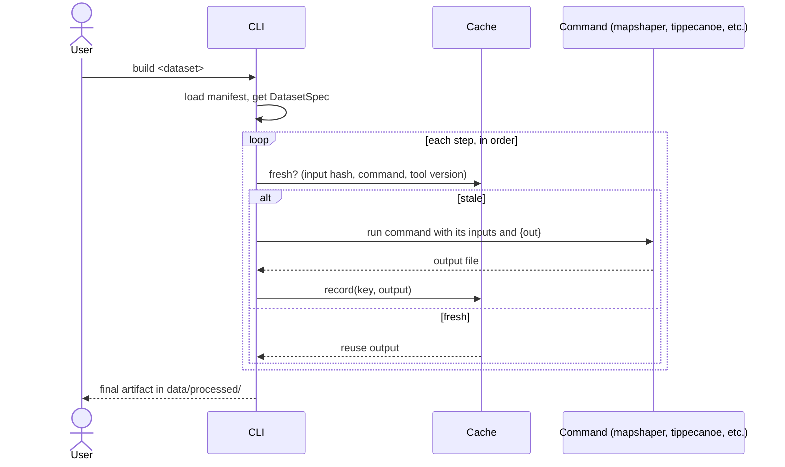

## Build sequence

```mermaid
sequenceDiagram
    actor User
    participant CLI
    participant Cache
    participant Tool as Command (mapshaper, tippecanoe, etc.)

    User->>CLI: build <dataset>
    CLI->>CLI: load manifest, get DatasetSpec

    loop each step, in order
        CLI->>Cache: fresh? (input hash, command, tool version)
        alt stale
            CLI->>Tool: run command with its inputs and {out}
            Tool-->>CLI: output file
            CLI->>Cache: record(key, output)
        else fresh
            Cache-->>CLI: reuse output
        end
    end

    CLI-->>User: final artifact in data/processed/
```
